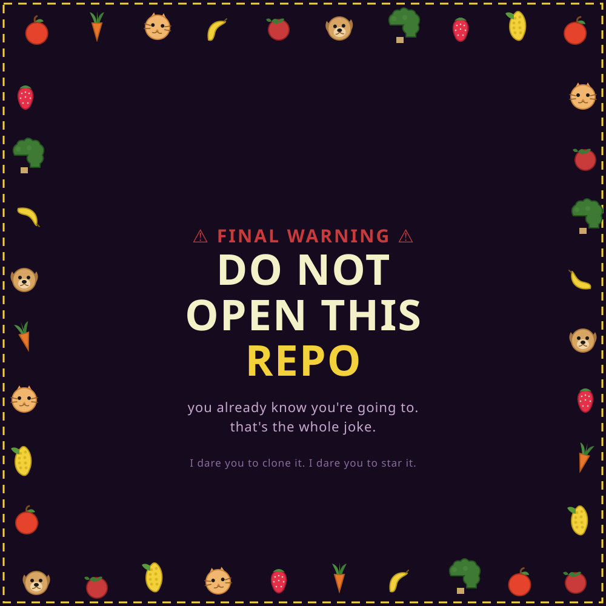

## THE RULES (you're already breaking them)

1. **Do not** open the files. Too late, you're reading the file.
2. **Do not** clone this repo. Your fingers are already hovering over `git clone`, aren't they.
3. **Do not** fork it, forking wakes them.
4. **Do not** star it, every star feeds them.
5. If you've read this far, it's already too late. Might as well keep going.

##  ACHIEVEMENTS UNLOCKED

- [x] Ignored a direct warning
- [x] Opened a repo titled "do-not-open"
- [x] Made it to the bottom of a README that told you to stop
- [ ] Turned back while you still could, **you never had this option**

---

*This repository is not responsible for any regret, existential dread, or sudden cravings for vegetable soup caused by proceeding further.*
